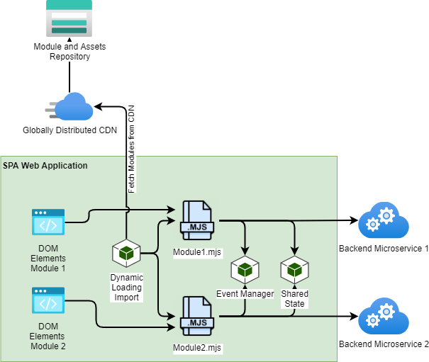

# WuGUI as a Microfrontend Framework

Wugui is a microfrontend framework designed to load generic ecmascript6 modules, their dependencies and assets, dynamically from a CDN.
Wugui also offers a means of sharing state, objects, services, classes, and dependencies between modules. Additionally there is included event management for triggering events between modules and a way to register ui <-> ui APIs between modules.

